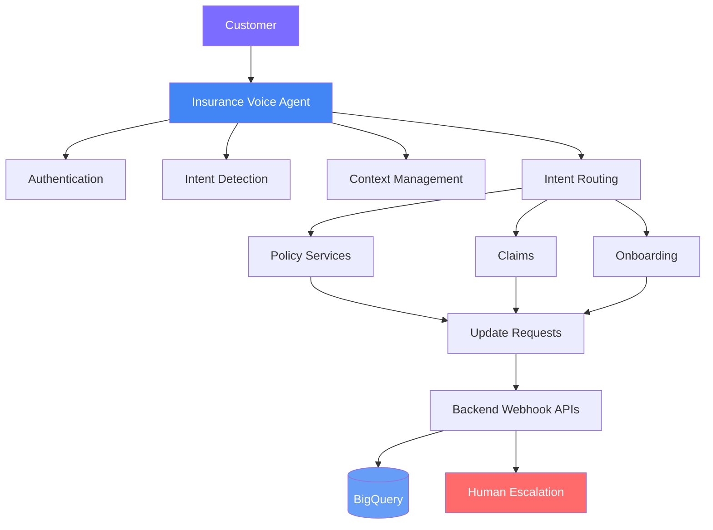

# 🛡️ Insurance Conversational AI Voice Agent

An enterprise-oriented **Conversational AI Voice Agent** that automates insurance customer service workflows — authentication, policy management, claims, onboarding, customer updates, and human escalation.

Built using **Google Cloud CX Agent Studio**, Python-based backend services, webhooks, and BigQuery, with a modular multi-agent architecture.

  
  
  
  

 

## 📖 Table of Contents

- [Overview](#-overview)
- [Solution](#-solution)
- [Key Capabilities](#-key-capabilities)
- [Architecture](#️-architecture)
- [Tech Stack](#️-tech-stack)
- [Conversational Flows](#-conversational-flows)
- [Author](#-author)

 

## 🚀 Overview

Insurance contact centers handle a high volume of repetitive customer requests such as:

- Policy and coverage inquiries
- Claim status tracking
- New claim initiation
- Policy renewals
- Customer information updates
- New customer onboarding
- New policy purchases
- Human support escalation

This project demonstrates how **Conversational AI and agent-based workflows** can automate these interactions while maintaining authentication, contextual conversation handling, backend integration, security guardrails, and human handoff.

 

## 💡 Solution

The Insurance Voice Agent follows a structured conversational workflow:

1. Authenticate the customer
2. Understand the customer's intent
3. Route the request to the appropriate business workflow
4. Retrieve or update information through backend APIs
5. Maintain conversation context
6. Provide a contextual response
7. Escalate to a human agent when required

The architecture supports both **existing customers and new customers** through dedicated workflows.

 

## ✨ Key Capabilities

<table>
<tr>
<td width="50%" valign="top">

### 🔐 Customer Authentication
- Mobile number and date of birth verification
- Security question validation
- Authentication retry handling
- Session and context management

### 📋 Policy Management
- Multi-policy support
- Policy details lookup
- Benefits and coverage information
- Policy renewal
- Proactive renewal notifications

</td>
<td width="50%" valign="top">

### 🏥 Claims Management
- Claim status tracking
- New claim initiation

### 👤 Customer Onboarding
- Insurance product discovery
- Product coverage information
- New customer registration
- New policy purchase

</td>
</tr>
<tr>
<td width="50%" valign="top">

### 📝 Customer Updates
- Customer information update requests
- Request status tracking
- Human approval workflow for sensitive changes

</td>
<td width="50%" valign="top">

### 🤝 Human Escalation
- Support case creation
- Complete conversation context transfer
- Live agent handoff

</td>
</tr>
</table>

 

## 🏗️ Architecture

 

## 🛠️ Tech Stack

| Layer | Stack |
|---|---|
| **Conversational AI** | Google Cloud CX Agent Studio, Dialogflow CX, Conversational Flows |
| **Backend** | Python, Webhooks, REST APIs |
| **Data & Analytics** | BigQuery |
| **Session Management** | Session parameters, context preservation across turns |

 

## 🔀 Conversational Flows

The agent is built around **11+ modular conversational flows and subagents**, covering:

- Authentication & session handling
- Policy inquiry, renewal, and coverage lookup
- Claims initiation and status tracking
- New customer onboarding and policy purchase
- Sensitive-change approval routing
- Support-case creation and human-agent handoff

 

## 👩‍💻 Author

**Neha Kumari Nandini**

  
  

